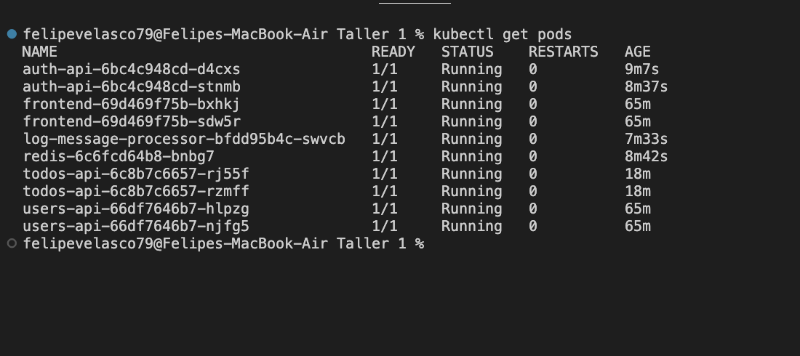
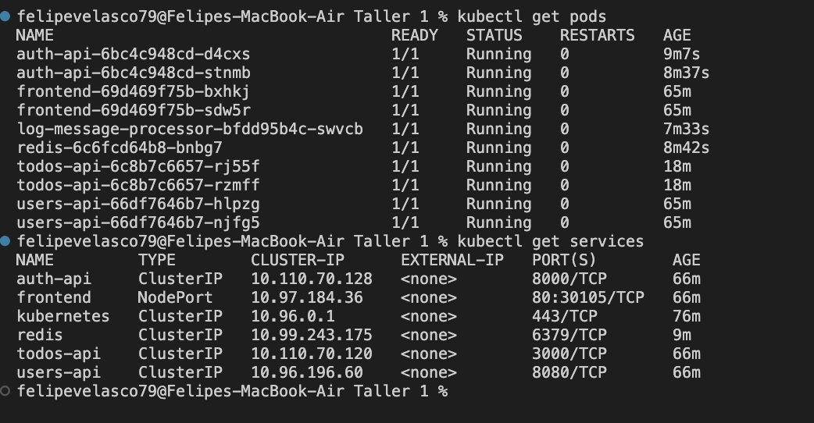
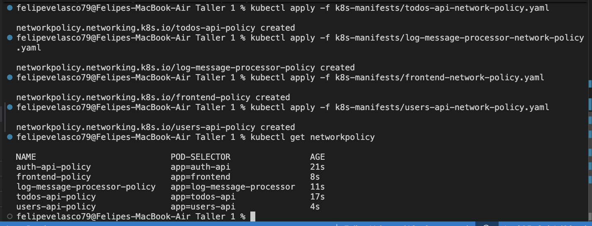
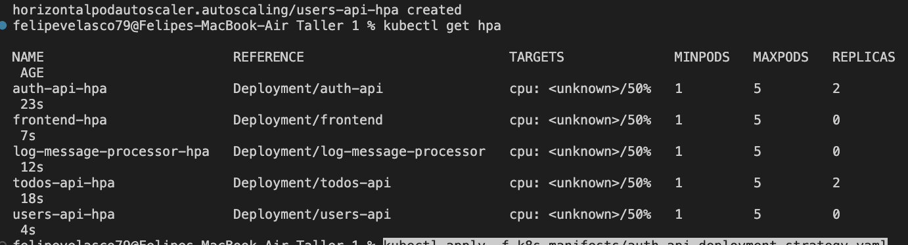
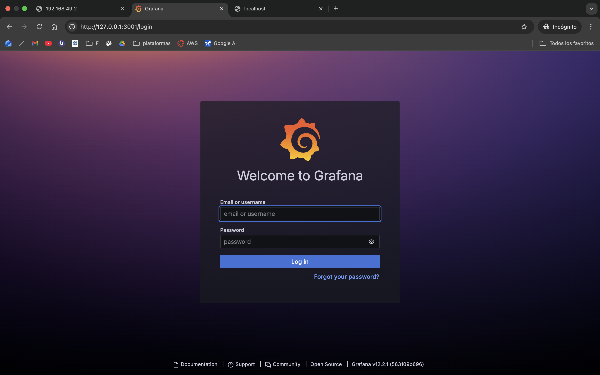
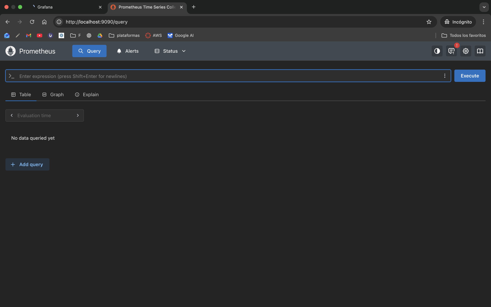
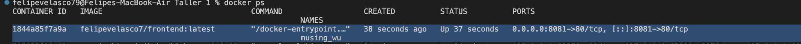
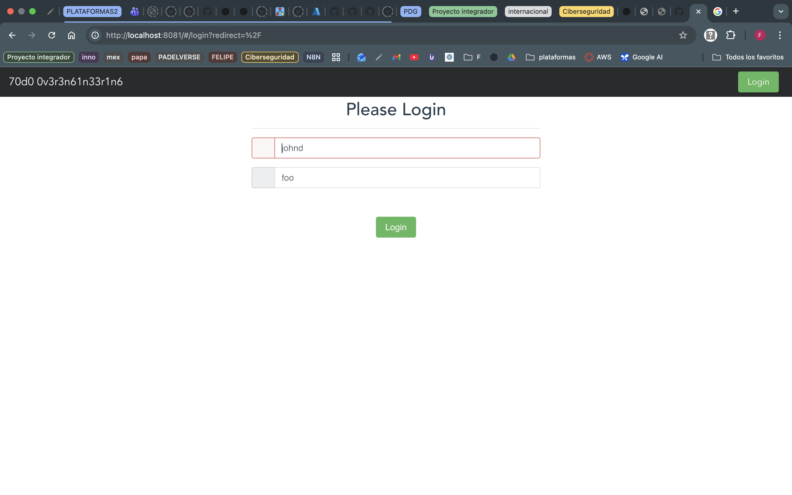
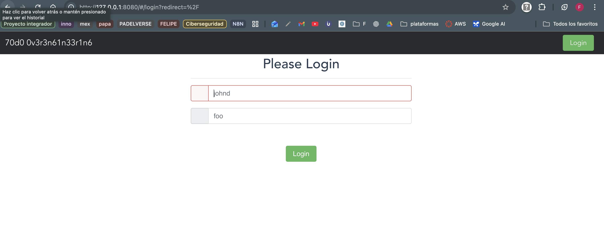
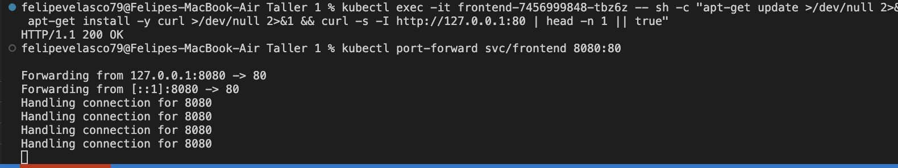

# Microservice App - PRFT Devops Training

This is the application you are going to use through the whole traninig. This, hopefully, will teach you the fundamentals you need in a real project. You will find a basic TODO application designed with a [microservice architecture](https://microservices.io). Although is a TODO application, it is interesting because the microservices that compose it are written in different programming language or frameworks (Go, Python, Vue, Java, and NodeJS). With this design you will experiment with multiple build tools and environments. 

## Components
In each folder you can find a more in-depth explanation of each component:

1. [Users API](/users-api) is a Spring Boot application. Provides user profiles. At the moment, does not provide full CRUD, just getting a single user and all users.
2. [Auth API](/auth-api) is a Go application, and provides authorization functionality. Generates [JWT](https://jwt.io/) tokens to be used with other APIs.
3. [TODOs API](/todos-api) is a NodeJS application, provides CRUD functionality over user's TODO records. Also, it logs "create" and "delete" operations to [Redis](https://redis.io/) queue.
4. [Log Message Processor](/log-message-processor) is a queue processor written in Python. Its purpose is to read messages from a Redis queue and print them to standard output.
5. [Frontend](/frontend) Vue application, provides UI.

## Architecture

Take a look at the components diagram that describes them and their interactions.


## Updated Build and Deployment Instructions
   ```bash
# Crear el archivo go.mod en la carpeta auth-api:
cd auth-api
go mod init auth-api
go mod tidy
# Para volver a la raiz
cd .. 
# Construir la imagen
docker build -t felipevelasco7/auth-api:latest ./auth-api
docker build -t felipevelasco7/todos-api:latest ./todos-api
docker build -t felipevelasco7/log-message-processor:latest ./log-message-processor
```
### Para el Frontend

1. **Instalar Dependencias**
```bash
   npm install --legacy-peer-deps
   # usar  `--legacy-peer-deps` flag to bypass peer dependency conflicts.
```
    

2. **Build the Application**
```bash
   npm run build
   ```
This compiles the Vue.js frontend into static assets.

3. **Build the Docker Image**
```bash
   docker build -t felipevelasco7/frontend:latest ./frontend
   ```
   This creates a Docker image with a multi-stage build (Node.js for building, nginx for serving).

4. **Run the Docker Container**
```bash
   docker run -p 8080:80 felipevelasco7/frontend:latest
   ```
   This serves the frontend on `http://localhost:8080`.


### Resolved Issues

1. **Peer Dependency Conflicts**
   - Used `--legacy-peer-deps` to resolve npm installation issues caused by strict peer dependency checks.

2. **Webpack Configuration**
   - Downgraded to webpack 3 to match legacy project requirements.
   - Replaced `mini-css-extract-plugin` with `extract-text-webpack-plugin`.
   - Updated `vue-loader` and other loaders to compatible versions.

3. **Docker Build**
   - Switched to Node.js 16 for compatibility with the project's build script.
   - Used a multi-stage Dockerfile to build and serve the application efficiently.


## Despliegue en Kubernetes (Minikube)

Esta sección resume todo lo que hicimos para que la app funcione en Kubernetes con Minikube, incluyendo imágenes, manifiestos y acceso al frontend.

### Prerrequisitos
- Docker
- kubectl
- Minikube (driver Docker recomendado en macOS)

### Construcción de imágenes Docker
Desde la raíz del repo:

```bash
# Users API (Java Spring Boot)
docker build -t felipevelasco7/users-api:latest ./users-api

# Auth API (Go)
cd auth-api
go mod init auth-api || true
go mod tidy
cd ..
docker build -t felipevelasco7/auth-api:latest ./auth-api

# TODOs API (Node.js)
docker build -t felipevelasco7/todos-api:latest ./todos-api

# Log Message Processor (Python)
docker build -t felipevelasco7/log-message-processor:latest ./log-message-processor

# Frontend (Vue + nginx)
docker build -t felipevelasco7/frontend:latest ./frontend
```

Opciones para que Kubernetes use tus imágenes:
- Opción A (recomendada): subir al registro
   ```bash
   docker push felipevelasco7/users-api:latest
   docker push felipevelasco7/auth-api:latest
   docker push felipevelasco7/todos-api:latest
   docker push felipevelasco7/log-message-processor:latest
   docker push felipevelasco7/frontend:latest
   ```
- Opción B: cargar imágenes locales en Minikube (sin push)
   ```bash
   minikube image load felipevelasco7/users-api:latest
   minikube image load felipevelasco7/auth-api:latest
   minikube image load felipevelasco7/todos-api:latest
   minikube image load felipevelasco7/log-message-processor:latest
   minikube image load felipevelasco7/frontend:latest
   ```

### Manifiestos de Kubernetes
Todos los manifiestos están en `k8s-manifests/` e incluyen Deployments y Services para cada microservicio, más Redis:

- `users-api-deployment.yaml` (puerto 8080)
- `auth-api-deployment.yaml` (puerto 8000)
- `todos-api-deployment.yaml` (puerto 3000)
- `log-message-processor-deployment.yaml` (vars de Redis)
- `redis-deployment.yaml` (puerto 6379)
- `frontend-deployment.yaml` (NodePort; nginx en puerto 80)

Aplicar todo:
```bash
kubectl apply -f k8s-manifests/
```

Verificar:
```bash
kubectl get pods -o wide
kubectl get svc
```

### Variables de entorno importantes
- Auth API (`k8s-manifests/auth-api-deployment.yaml`):
   - `AUTH_API_PORT=8000`
   - `USERS_API_ADDRESS=http://users-api:8080`
   - Nota: No usar prefijos tipo `tcp://` en direcciones. Debe ser `host:puerto` o una URL HTTP válida.
- Log Message Processor (`k8s-manifests/log-message-processor-deployment.yaml`):
   - `REDIS_HOST=redis`
   - `REDIS_PORT=6379`
   - `REDIS_CHANNEL=log`

### Acceso al Frontend
Hay 3 formas prácticas:

1) NodePort (sin túnel):
```bash
minikube ip
# Ejemplo: 192.168.49.2
# Ver NodePort asignado
kubectl get svc frontend
# Abrir en el navegador: http://<MINIKUBE_IP>:<NODE_PORT>
```

2) Comando asistido de Minikube (crea túnel local si hace falta):
```bash
minikube service frontend
```

3) Port-forward (Service o Deployment):
```bash
# Service -> expone 80 del Service hacia localhost:8080
kubectl port-forward svc/frontend 8080:80

# O directo al Deployment/Pod (útil para debug):
kubectl port-forward deploy/frontend 8080:80
```

### Nota sobre la imagen del Frontend (http-server vs nginx)
Inicialmente la imagen podía ejecutar `http-server` en el puerto 8080. Para un despliegue más estable, cambiamos a la imagen basada en nginx que sirve estáticos en el puerto 80.

- Manifiesto final: `k8s-manifests/frontend-deployment.yaml` apunta a `image: felipevelasco7/frontend:nginx-80`, `containerPort: 80`, y el Service usa `targetPort: 80` (tipo `NodePort`).
- Para usar esta imagen en Minikube sin publicar en Docker Hub:
   ```bash
   docker tag felipevelasco7/frontend:latest felipevelasco7/frontend:nginx-80
   minikube image load felipevelasco7/frontend:nginx-80
   kubectl rollout restart deployment/frontend
   ```
- Alternativa: publicar la imagen `nginx-80` y dejar `imagePullPolicy: IfNotPresent`.

### Solución de problemas comunes
- CrashLoopBackOff en Auth API con mensaje "too many colons in address":
   - Asegúrate de no usar `tcp://` en la dirección. Debe ser `10.0.0.1:8000` o una URL HTTP válida configurada en variables del Deployment.
- `Error: Cannot find module '/usr/src/app/server.js'` en TODOS API:
   - Verifica el Dockerfile copia `server.js` y el `WORKDIR` es correcto (`/app` en nuestro caso) y que el `CMD` sea `node server.js`.
- Python `main.py not found` en Log Message Processor:
   - Asegura que el Dockerfile copie explícitamente `main.py` al `WORKDIR` (`/app`).
- Port-forward inestable al frontend:
   - Prefiere `minikube service frontend` o usa NodePort.
   - Con nginx en puerto 80, `kubectl port-forward svc/frontend 8080:80` suele ser más estable que con `http-server` en 8080.


## Aplicar Network Policies

Las Network Policies permiten controlar el tráfico de red entre los pods y servicios en el clúster. A continuación, se muestra cómo aplicar una política de red básica para restringir el acceso a un microservicio.


### Aplicar Network Policies

Para aplicar las políticas de red a los microservicios, sigue estos pasos:

1. Aplica cada archivo de NetworkPolicy:

```bash
kubectl apply -f k8s-manifests/auth-api-network-policy.yaml
kubectl apply -f k8s-manifests/todos-api-network-policy.yaml
kubectl apply -f k8s-manifests/log-message-processor-network-policy.yaml
kubectl apply -f k8s-manifests/frontend-network-policy.yaml
kubectl apply -f k8s-manifests/users-api-network-policy.yaml
```

2. Verifica que las políticas se hayan aplicado correctamente:

```bash
kubectl get networkpolicy
```

### Configurar ConfigMaps

Los ConfigMaps permiten gestionar las variables de entorno y configuraciones de los microservicios. Sigue estos pasos para aplicarlos:

1. Aplica cada archivo de ConfigMap:

```bash
kubectl apply -f k8s-manifests/auth-api-configmap.yaml
kubectl apply -f k8s-manifests/todos-api-configmap.yaml
kubectl apply -f k8s-manifests/log-message-processor-configmap.yaml
kubectl apply -f k8s-manifests/frontend-configmap.yaml
kubectl apply -f k8s-manifests/users-api-configmap.yaml
```

2. Verifica que los ConfigMaps se hayan aplicado correctamente:

```bash
kubectl get configmaps
```

### Configurar Horizontal Pod Autoscaler (HPA)

El HPA permite escalar automáticamente los pods según el uso de recursos. Sigue estos pasos para aplicarlos:

1. Aplica cada archivo de HPA:

```bash
kubectl apply -f k8s-manifests/auth-api-hpa.yaml
kubectl apply -f k8s-manifests/todos-api-hpa.yaml
kubectl apply -f k8s-manifests/log-message-processor-hpa.yaml
kubectl apply -f k8s-manifests/frontend-hpa.yaml
kubectl apply -f k8s-manifests/users-api-hpa.yaml
```

2. Verifica que los HPA se hayan aplicado correctamente:

```bash
kubectl get hpa
```

### Configurar Estrategias de Despliegue

Las estrategias de despliegue permiten realizar actualizaciones continuas (rolling updates) o despliegues canarios para minimizar el tiempo de inactividad. Sigue estos pasos para aplicarlas:

1. Aplica cada archivo de estrategia de despliegue:

```bash
kubectl apply -f k8s-manifests/auth-api-deployment-strategy.yaml
kubectl apply -f k8s-manifests/todos-api-deployment-strategy.yaml
kubectl apply -f k8s-manifests/log-message-processor-deployment-strategy.yaml
kubectl apply -f k8s-manifests/frontend-deployment-strategy.yaml
kubectl apply -f k8s-manifests/users-api-deployment-strategy.yaml
```

2. Verifica que los despliegues se hayan actualizado correctamente:

```bash
kubectl rollout status deployment/auth-api
kubectl rollout status deployment/todos-api
kubectl rollout status deployment/log-message-processor
kubectl rollout status deployment/frontend
kubectl rollout status deployment/users-api
```

## Implementación de Monitoreo con Prometheus y Grafana

### Despliegue de Prometheus
1. Aplica el manifiesto de Prometheus:
   ```bash
   kubectl apply -f k8s-manifests/prometheus-deployment.yaml
   ```
2. Accede a Prometheus en tu navegador:
   ```
   http://<minikube-ip>:30000
   ```

### Despliegue de Grafana
1. Aplica el manifiesto de Grafana:
```bash
   kubectl apply -f k8s-manifests/grafana-deployment.yaml
   # verificar
   kubectl get svc
   ```
2. Accede a Grafana en tu navegador:
   ```
   http://<minikube-ip>:30001
   ```
   - Usuario: `admin`
   - Contraseña: `admin`

### Configuración de Grafana
1. Agrega Prometheus como fuente de datos:
   - Ve a **Configuration > Data Sources**.
   - Selecciona **Prometheus**.
   - Ingresa la URL: `http://prometheus:9090`.

2. Importa dashboards predefinidos:
   - Ve a **Dashboards > Import**.
   - Usa un ID de dashboard de la comunidad, como `315` (Kubernetes cluster monitoring).

### Verificación
- Asegúrate de que Prometheus esté recopilando métricas de tus microservicios.
- Visualiza las métricas en los dashboards de Grafana.

### Limpieza completa (recursos, Minikube y imágenes locales)

Si quieres dejar tu máquina en el mismo estado en el que estaba antes de desplegar todo, sigue uno de los tres niveles siguientes según lo destructivo que quieras ser.

1) Solo Kubernetes (eliminar los recursos aplicados desde este repo)

```bash
# Elimina todos los recursos definidos en el directorio de manifiestos
kubectl delete -f k8s-manifests/

# Verifica que los pods y servicios hayan sido eliminados
kubectl get pods -A
kubectl get svc -A
```

2) Kubernetes + detener/eliminar Minikube (elimina también el cluster local)

Esto eliminará el cluster Minikube y su estado (volúmenes, PVs, datos en el cluster).

```bash
# Primero elimina recursos dentro del cluster
kubectl delete -f k8s-manifests/ || true

# Detener Minikube (intento no destructivo)
minikube stop || true

# Si quieres borrar todo (destructivo) y recrear después, usa:
minikube delete

# Para recrear el cluster (opcional):
minikube start --driver=docker
```

3) Limpieza completa incluyendo imágenes Docker locales (opcional y destructivo)

WARNING: Esto eliminará imágenes que hayas construido localmente. Asegúrate de que no las necesites.

```bash
# Lista las imágenes que el repo creó (ejemplos)
docker images --filter=reference='felipevelasco7/*'

# Elimina imágenes específicas (ejemplo):
docker rmi felipevelasco7/frontend:latest felipevelasco7/auth-api:latest \
   felipevelasco7/todos-api:latest felipevelasco7/log-message-processor:latest felipevelasco7/users-api:latest || true

```


## Foto evidencia










